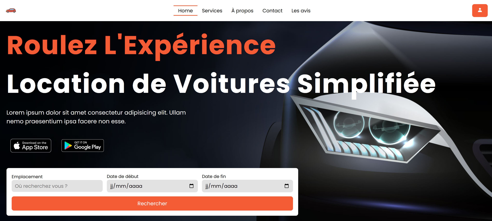

# 🚗 Car Rental - Location de Voitures


## Description

Site web de location de voitures avec interface moderne et responsive. Projet réalisé en HTML/CSS/JS dans le cadre d'un exercice de développement front-end.

## Fonctionnalités

- Page d'accueil avec formulaire de recherche
    
- Catalogue des véhicules disponibles
    
- Page "À propos" de l'entreprise
    
- Formulaire de contact
    
- Section des avis clients
    
- Newsletter
    
- Menu burger sur mobile
## Structure

```
├── index.html          # Page principale
├── home.html           # Accueil
├── services.html       # Catalogue voitures
├── about.html          # À propos
├── contact.html        # Contact
├── style.css           # Styles
└── images/             # Dossier des images
```

## Installation

1. Clone le repo
    
2. Ouvre `index.html` dans ton navigateur
    
3. Pas besoin d'installation supplémentaire

## Personnalisation rapide

Les couleurs principales sont dans `style.css` :

```
:root {
   --accent: rgb(244, 92, 54);
   --accent2: rgb(189, 56, 22);
}
```

